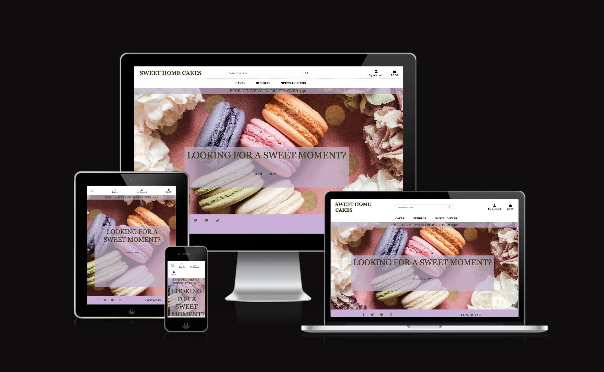
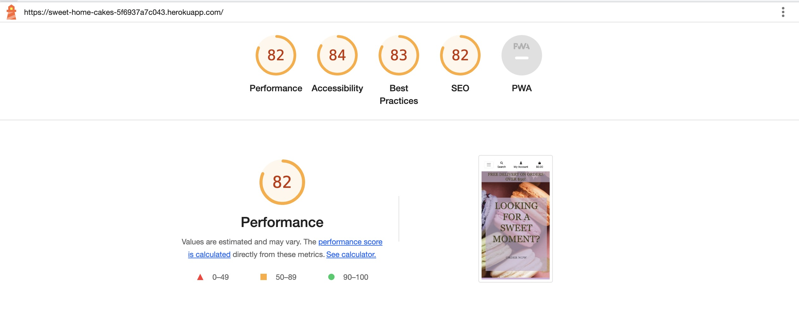

# Restaurant Booking NH
## Introduction
This website is designed for a fictional bakery restaurant. Through Sweet Home Cakes users can see bakery products, then order online, create an account, log in, leave a review, add products to favourite lists. 

This website has been created as the Fifth Milestone Project for Code Institute's Full Stack Software Development Diploma - E-Commerce Specialization and was built using Full Stack Toolkit. The project is using Django, Python, HTML and CSS as the main technologies. 

[Live Version]()

## Site Goals:
* Allow users to create an account 
* Allow users to see products
* Allow users to make a purchase 
* Allow users to create an account, log in and log out 
* Allow registered users to add products to their favourite lists or remove them 
* Allow site admin to add or remove products 
* Allow site admin to see orders, reviews, contact mails from users

# Table of contents:
1. [UX](#ux)
  * [User Stories](#user-stories) 
  * [Development Planes](#development-planes)
    * [Strategy](#strategy)
    * [Scope](#scope)
    * [Structure](#structure)
    * [Wireframes](#wireframes)
    * [Surface](#surface)
2. [Features](#features)
3. [Technologies](#technologies)
4. [Manual Testing](#manual-testing)
  * [Responsiveness](#responsiveness)
  * [Browser Compatibility](#browser-compatibility)
  * [Lighthouse](#lighthouse)
  * [Features Testing](#features-testing)
5. [Validation](#validation)
6. [Deployment](#deployment)
7. [Credits](#credits)

# UX
## User Stories 
This project was developed with agile planning. This means that each feature was split first into User Stories for what the user of the website would expect. GitHub issues were used to record all the user stories. As the project progressed each story was then moved from 'To Do' to 'In Progress' to 'Done'.

* As a customer you will:
  * Be able to create an account.
  * Be able to see products.
  * Be able to create an account. 
  * Be able to add products to your bag and then order them.
  * Be able to add products to your favourite list. 
  * Be able to see your orders.
  * Be able to leave feedback. 

* As a site administrator you will:
  * Be able to see orders and order's details. 
  * Be able to see details of the customers.
  * Be able to view messages and feedback from users.
  * Be able to add or remove products. 

## Development Planes
### Strategy
#### Targeted Users
* A user that wants to buy a cake from Sweet Home Cakes who could be an old or a new user of any age group that prefers to use an online easy purchasinf system. 

#### Site Goals
* For users to be able to create an account.
* For users to be able to order cakes.
* For users to be able to see their orders and create favourites.

#### Project Goals 
* Create a bakery website that will help facilitate their services and reduce the human workload by having an easy-to-use ordering system which they can access easily. This will bring them a quick way of checking the number of orders and also they will be able to keep their customer's information. 
* Learn how to create a Full Stack Project - E-commerce Application.

### Scope 
The Scope Plane was about developing website requirements based on the goals set out in the strategy plane.
* Home page welcome message which immediately tells the user what the site is for.
* Account registration which will allow for restricted viewing, adding products to cart, adding products to wishlist, leave feedback and contact company.
* Fully responsive website, tested across all screen sizes, with navigation for mobile.
* Ability to create, view and make orders.

### Structure
The information above has been used then to create the structure of the site. The diagram has been generated by following these steps created with the Lucidchard app.

### Wireframes 
Before building, and planning this website I used the design tool Balsamiq, to create a wireframe for the project. It allowed me to make a basic sketch of what I wanted the website to look like, what features to include and where to place them. This proved to be very useful as I could base my decisions on the already sketched-out wireframe when building the website.

### Surface
#### Style and colours
The style I was aiming for in the end would be an elegant and warm impression and I wanted it to be a theme throughout the entire website. 

Colours have been specified in CSS by hexadecimal (or hex) values. The colours used are complementary.

The navigation bar is lila and the content is light pink. The footer is lila which fits well with the rest of the colours.

The font style used is Bacasime Antique, Lato and Georgia from Google Fonts. 

# Features
## Existing Features
  1. Home Page 
  
   On the landing page, the user is welcomed and assured about what the site is about through a main message from where can start ordering directly. Also, the navbar and footer are present from where he can explore further.

  2. Navigation
  
  At the top of every view, the user is presented with a navbar. The navbar contains the restaurant's logo, which by clicking, allows the user to return to the front page at any time. Also to the right, the navbar consists of links to User's Account and Cart. In between these two user can find a search area from where can search for an exact product or category.
  On smaller screens, all the above features collapse under a hamburger menu, except for the logo which always stays on the left of the navigation bar. Underneath these there is another smaller navbar from where user can look at products, by categories or see them all. 

  3.  Making an Order
  
  From the products user can select a specific product and then will be directed to a product's details page. Once here user can see product's details, rating and price, add this to cart and, if logged in, can add this to favourites.

  4. Register
  
  On the register page user will have to fill in their details, register and then log in, to be able to see orders and make favoruites list.  
 
  5. Orders 
  
  Once logged in user can add products to your list or delete them and see orders. 

  6. Footer 
  
  The footer section is present on all pages and it includes links to all social media pages and from there user can contact bakery. It is useful for the user as it encourages them to keep connected through social media and it also helps the bakery, as it increases publicity.

  7. Cart
  
  Once on cart page user can fill in details of the delivery address and cart details and then make purchase.

  8. Leave Feedback
  
  Once purchase made they will be presented with confirmed order details and they will have the option to leave a feedback.

  9. Favourites
  
  Once user logged in, can add products to favourites and these will be shown in the favourite's list. 

  
## Features Left to Implement
  * User should be able to leave a review on each products which will be shown into the product's details page. 
  * User should be able to create cakes based on a list of ingredients.

# Technologies
For this project, the following technologies were used.  

## Languages:
* HTML
* CSS
* Python
* Javascript
 
## Frameworks, Libraries, Programs & Applications Used:
* Django
* PostgreSQL
* Bootstrap

### Google Font
* Google Font was used to import the chosen font for this project Lora.

### Font Awesome
* Font Awesome was used on each page of the website to provide icons for UX purposes.  

### GitPod
* GitPod was used for writing all the code for this project. It was also used to commit and push to GitHub.  

### GitHub 
* GitHub was used to store this project.

### Heroku
* Heroku was used to deploy the project.

### Cloudinary
* Cloudinary was used to store some of the images used in this project

### Balsamiq 
* Balsamiq was used to draw initial Wireframes for this project.

### Lucidchart
* Lucidchart was used during the structure phase of this project. It was used to create a sitemap for the website. 

### Google Development Tools
* Google Dev Tools was used to edit code and check responsiveness before making the changes permanent.

# Manual Testing 
## Responsiveness
Nicoles Sweet Home project looks and works on different browsers and screen sizes. Manual testing was conducted for responsiveness on small, medium and large screens. Elements on all pages respond as intended on all devices.

## Browser Compability
I have tested that this website works as intended in browsers: 
* Chrome
* Firefox

## Lighthouse 

### Accessibility
I confirmed that the colors and fonts chosen are easy to read and accessible by running it through Lighthouse in Chrome DevTools.

## Features Testing
Manual testing was conducted on the following elements that appear on every page:
* Test that Logo redirects to home screen.
* Test that Navbar hamburger toggle works.
* Test that Navbar login/out button works.
* Test that Social Links in Footer work and open in a new page.
* Test that buttons styles respond consistently.

# Validation
* HTML: - No errors were found when passed through the [W3C Validator tool](https://validator.w3.org/#validate_by_input)

* CSS: - No errors were found when passed through the [W3C Validator tool](https://jigsaw.w3.org/css-validator/validator) tool

* JavaScript: - No costume Javascript was used in this project. The Javascript included at the end of my base.html was taken from the Code Institutes walkthrough project.

* No errors were returned when passing through [CI Python Linter](https://pep8ci.herokuapp.com/).

## Fixed Bugs 
* I was unable to migrate because of an error: column "email" not found. I struggled to understand this at first as wouldn't get from where was coming. I spent about two hours with my mentor that has guided me and helped me understand that I would have to erase this email col from the database and then add it again, changes to the migration files had to be done subsequently. We still did not find the reason for this error but we have managed to resolve it. 
* When using screens smaller than 400px there would be an extra white space on the right side of the page which was coming from a margin of the col-md-5 that has previously been set in "%". Once that measurement changed to px space disappeared. 
* Previously users would be able to make more bookings on the same day and at the same time, which has been changed by adding constraints to the data model. 

# Deployment
The following are the steps I went through to deploy my live site:

* The site was deployed using Heroku. The steps to deploy are as follows: 
1. Go to [Heroku](https://dashboard.heroku.com/apps)
2. Go to 'New' and select 'Create a new app'
3. Input your app name and create app.
4. Navigate to 'Settings'
5. On the Config Vars section, enter the following values:
    * SECRET_KEY: The Secret Key for your project
    * DATABASE_URL: The URL from your ElephantSQL dashboard
    * CLOUNDINARY_URL: The URL from your Cloudinary dashboard
    * PORT: 8000
6. Navigate to the 'Deploy' section. 
7. Connect to GitHub, search for your repo and confirm. 
8. Choose branch to deploy.
9. Your app should now be available to see. You can choose whether to have your app automatically redeploy with every push or to keep it manual. 

* To Fork the repository:
  * On GitHub.com, navigate to the repository.
  * In the top-right corner of the page, click Fork.
  * Select an owner for the forked repository.
  * By default, forks are named the same as their parent repositories. You can change the name of the fork to distinguish it further.
  * Optionally, add a description of your fork.
  * Choose whether to copy only the default branch or all branches to the new fork.
  * Click Create fork.

* To Clone the repository:
  * On GitHub.com, navigate to the repository.
  * Above the list of files, click the Code button.
  * Copy the URL for the repository.
  * Open Git Bash.
  * Change the current working directory to the location where you want the cloned directory.
  * Type git clone, and then paste the URL you copied earlier.
  * Press Enter. Your local clone will be created.

# Credits

1. [Code Institute Template](https://github.com/Code-Institute-Org/python-essentials-template)
    - This repository was created using the template provided by Code Institute. Also, without the knowledge gained through the coursework, I would not be able to create this site so thank you Code Institute.
1. [Django Documentation](https://docs.djangoproject.com/en/4.0/)
    - Thanks to the Django docs which were also used as a step-by-step while going through the project to ensure everything was set up correctly.
1. [Allauth Documentation](https://django-allauth.readthedocs.io/en/latest/faq.html)
    - Thanks to the Alluath documentation which was referenced during development.
1. [Stackoverflow](https://stackoverflow.com/)
    - I found myself on Stackoverflow so many times researching issues. This a fantastic place to learn and troubleshoot code.
1. [Slack](https://slack.com/intl/en-ie/)
    - The slack community is great and I reached out to fellow students who had already completed their P4 for their advice and got some nice tips and feedback.
1. [Youtube](https://www.youtube.com/)
    - Various videos were watched for further learning and Django project ideas in creating a booking system.